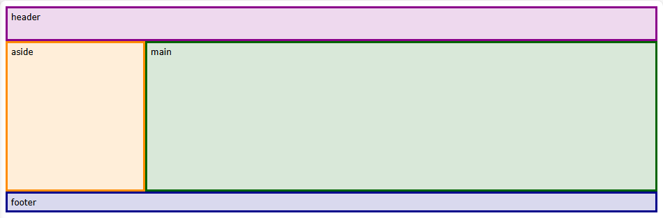
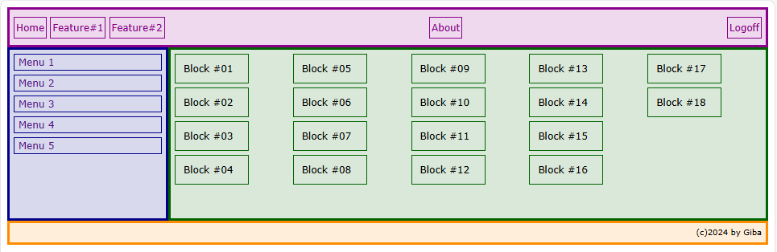
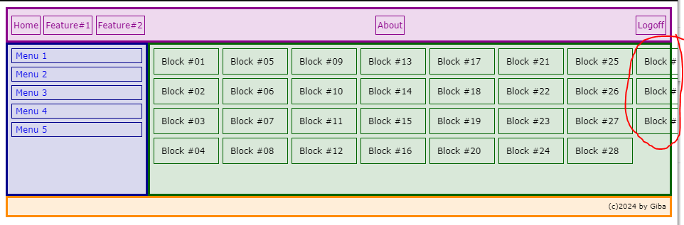
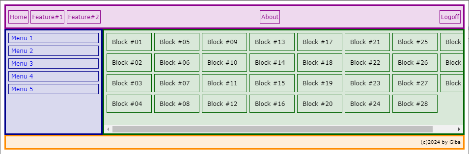

# CSS Flexbox ou Grid Layout? Entenda as Diferenças e Escolha a Melhor Opção


No desenvolvimento de páginas HTML, um dos grandes desafios sempre foi a programação de layouts responsivos e flexíveis utilizando somente CSS. Era necessário utilizar *float*, *position*, *inline-block*, ou a combinação destes controles, apesar de algumas vezes se utilizar erroneamente a tag *TABLE* para formatar o layout.

Com o avanço do CSS foram introduzidas novas ferramentas poderosas que facilitam a tarefa de organizar e dispor elementos na página, mais precisamente o **CSS Grid Layout** e o **Flex Layout**.

Neste artigo, vamos explorar as características fundamentais de ambos os métodos de controle do layout e do seu conteúdo, e demonstrar como esses poderosos recursos do CSS podem transformar a maneira como você constrói suas páginas web.

Enquanto o CSS Grid Layout proporciona um controle bidimensional, permitindo alinhar itens em linhas e colunas, o Flex Layout oferece um controle unidimensional, ideal para alinhar itens ao longo de um eixo principal. Ao compreender as particularidades e vantagens de cada um, você será capaz de escolher a abordagem mais adequada para cada situação, criando interfaces mais eficientes e esteticamente agradáveis.

Apesar de possibilitarem organizar o layout de seus elementos-filhos (chamados de itens) em linhas e colunas, os dois tem propósitos diferentes.

**Flex:**

O foco dele é organizar os itens em linhas OU colunas como blocos, um ao lado do outro, ou um sobre o outro. É adequado para organizar layouts em uma dimensão (uma linha ou uma coluna), permitindo controlar o tamanho, alinhamento e distribuição dos seus itens.

**Grid:**

O nome já diz, serve para organizar seus itens de forma de grade, linhas E colunas, ou seja, em duas dimensões, possibilitando que cada item tenha um comportamento independente, por exemplo, ocupando um número de linhas e colunas específicos.

Uma vez definido o tipo do contêiner (com ```display: grid``` ou ```display: flex```), o elemento conteiner tem o comportamento de um *block*, e todos os seus filhos diretos se tornam itens grid ou itens flex.

Note que no *flex* as propriedades para manipular o tamanho e a distribuição dos elementos (*flex-basis, flex-grow e flex-shrink*) são aplicadas diretamente nos itens, enquanto que no *grid* os layouts complexos são definidos diretamente no container, e os filhos (*grid-items*) se adaptam às definições das *grid-templates*.

## Quando usar Grid ou Flex?

Um uso bastante comum é definir o template de uma página organizando suas áreas através do *grid*, e organizar o preenchimento dessas áreas ou os seus componentes através de *flex*.

**Uso do Grid:**

Devemos usar o *grid* para definir o template de uma página, delimitando áreas como **header**, **main** e **footer**, criando o layout onde os elementos vão se encaixar dentro deles, e não o contrário.

Assim fica fácil redefinir o layout (responsividade, por exemplo) ajustando o containeres *grid* nas *media queries* sem ter que ajustar todos os elementos.

> *Fig1 -* Definindo áreas com *grid*.

Combinando com o uso de elementos *flex*, fica fácil definir designs preenchendo as áreas com múltiplas linhas ou múltiplas colunas.

Há casos em que devemos aplicar a lógica de *grid* dentro de componentes ou de seções, quando precisamos aplicar diversas propriedades nos elementos filhos para eles se encaixarem no layout, ou quando queremos sobrepor elementos em um mesmo local.

**Uso do Flex:**

O *flex* é perfeito para enfileirar elementos de diversos tamanhos. Nele o container define a direção na qual os elementos vão se enfileirar e como eles devem se comportar ao atingir as beiradas do container. Também são definidos como os itens são alinhados independente do tamanho individual de cada item.

> *Fig2 -* Formatando os componentes com *flex*.

Acesse o código deste exemplo em [codepen.io](https://codepen.io/gtnasser/pen/PorbeGY)

## Melhoria pós publicação:

Muitos me questionaram por que o container *main* é extrapolado quando a quantidade de elementos cresce, ou seja, os elementos continuam seguindo a orientação da regra do *flex* mas são desenhados fora das bordas do container, quando deveriam ficar sempre dentro do container.

> *Fig3 -* Elementos extrapolando os limites do *container*.

O tamanho do container não expande por causa das definições do *grid*, e uma maneira simples e rápida de resolver isso é incluir a propriedade ```overflow: auto;``` no estilo do container, assim é mostrado um *scrollbar* no container na direção que os elementos estão extrapolando o seu limite, mantendo assim a orientação da regra do *flex*.

> *Fig4 -* Elementos contidos nos limites do *container*.

Acesse o código deste exemplo em [codepen.io](https://codepen.io/gtnasser/pen/gbYVVXM).

## Conclusão:

Simplificadamente podemos dizer que o *grid* (por agir de forma bidimensional) oferece um maior controle na definição do container, enquanto o *flex* (por agir de forma unidimensional) oferece uma maior controle na distribuição dos elementos dentro de cada container. E bem levianamente, o *grid* cuida da forma e o *flex* apresenta o conteúdo.

Quando combinados os dois controles são poderosíssimos, e são praticamente complementares, obviamente que cada caso é um caso, mas uma boa análise permitirá entender como utilizá-los para que qualquer conteúdo possa ser publicado no layout desejado.

Acesse o código completo deste e outros artigos em [Github](https://github.com/gtnasser/artigo-dio-flex-grid)

Saiba mais sobre o autor em [Linkedin](https://www.linkedin.com/in/gilbertonasser/)

